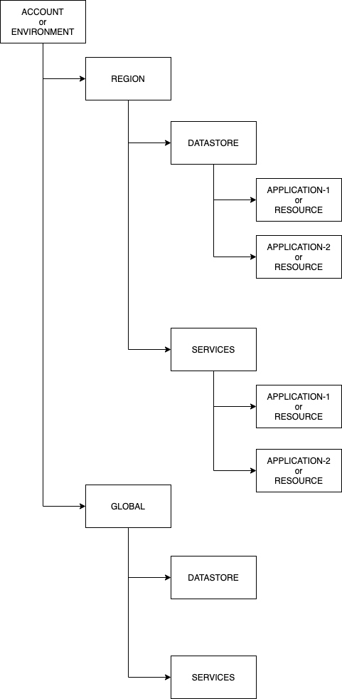

# Terraform

This project uses terraform + terragrunt to provision and manage cloud infrastructure.

[Terragrunt](https://github.com/gruntwork-io/terragrunt) is a thin wrapper for terraform that provides extra tools for keeping your Terraform configurations DRY.

## Requirements

| Name       | Version             |
|------------|---------------------|
| terraform  | >= 0.13.4, < 0.14.0 |
| terragrunt | >= 0.25.4           |

## Backend, Provider and Isolation configuration

Using terragrunt we are able to generate the backend and provider configurations dynamically.

In fact, this project uses the directory path as an identifier for the key that will be used by terraform to store the state in Bucket s3 and DynamoDB.

In that way, we are able to achieve complete isolation between each application / resource, in addition to reducing the number of necessary configurations.

The directory layout assumes the following schema to define the state key.


* **ACCOUNT/ENVIRONMENT** - The account name or the environment, this project assumes that each environment has it own account.
* **REGION/GLOBAL** - The code of the region where the resource will be running, somes resources like Cloudfront could not be associate with a region at this case this project assumes that it should be created in the **GLOBAL** aspect.
* **DATASTORE** - Destined to store configurations related to data instances like RDS, Elasticache, S3.
* **SERVICES** - Destined to store configurations related to applications services like EC2, Lambda, ALB, ECS, Security Groups and so on.
* **APPLICATION/RESOURCE** - That's where the terraform settings are stored

### Usage Example

```bash
~/git/terraform-friday ❯ tree
.
├── LICENSE
├── README.md
├── qa
│   ├── account.hcl
│   ├── eu-central-1
│   │   ├── datastore
│   │   │   └── crazy-weather
│   │   │       ├── backend.tf
│   │   │       ├── provider.tf
│   │   │       ├── s3.tf
│   │   │       └── terragrunt.hcl
│   │   ├── region.hcl
│   │   └── services
│   └── global
│       ├── datastore
│       └── services
└── terragrunt.hcl
```

At this case the state key for `crazy-weather` buckets will be `qa/eu-central-1/datastore/crazy-weather/terraform.tfstate`.

## Pre-commit

It's strong recommend use [pre-commit framework](https://pre-commit.com/), there specialize hooks configured in this project to help maintain a good code.

You can see more details directly in the site of the framework but a simple way to install is using homebrew.

```bash
brew install pre-commit
```

The [specilized hooks](https://github.com/antonbabenko/pre-commit-terraform) used by terraform needs some packages too. Again the easiest way is using homebrew.

```bash
brew install gawk terraform-docs tflint coreutils tfsec
brew tap bridgecrewio/checkov https://github.com/bridgecrewio/checkov
brew install checkov
```

If everything works correctly, before commiting, pre-commit will check all staged files, as in the example below.

```bash
$ git commit -am "Create crazy-weather buckets"
Check for merge conflicts................................................Passed
Trim Trailing Whitespace.................................................Passed
Check JSON...........................................(no files to check).Skipped
Detect AWS Credentials...................................................Passed
Terraform fmt............................................................Passed
Terraform docs...........................................................Passed
Terraform validate with tflint...........................................Passed
Terraform validate with tfsec............................................Passed
Checkov..................................................................Passed
[main 3651d66] Create crazy-weather buckets
```
